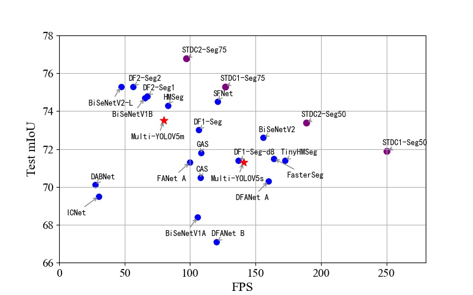
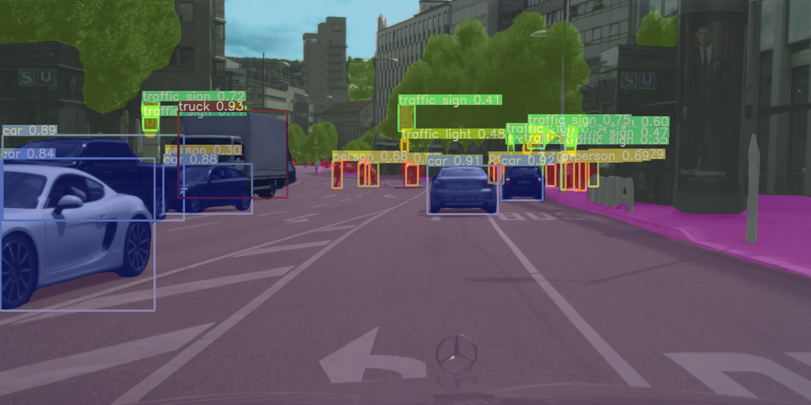
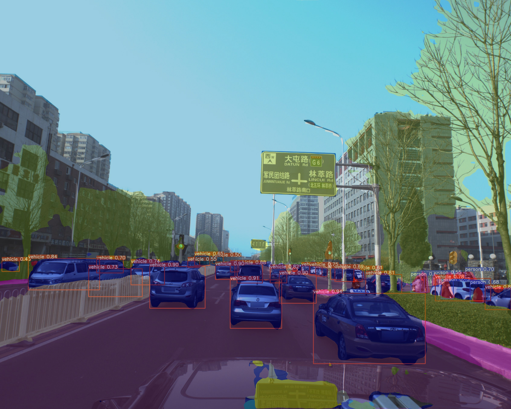

# Multi YOLO V5——Detection and Semantic Segmentation
## Overeview
This is my undergraduate graduation project which based on <a href="https://github.com/ultralytics/yolov5"> ultralytics YOLO V5 tag v5.0</a>.  
This multi-task model adds only a small amount of computation and inferential GPU memory (about 350MB) and is able to accomplish both object detection and semantic segmentation. Object detection metrics are slightly improved (compared to single-task YOLO) on my dataset (transfer from Cityscapes Instance Segmentation labels) and Cityscapes semantic segmentation metrics are shown below. **This repository will not be updated in the near future(after tag TomMao-2.0 realse)** and future version will **probably** be released to [MANA AI](http://www.manaai.cn). To save my time and facilitate handover, please forgive me for the following document will be written in Chinese.  
[Demo Video](https://www.bilibili.com/video/BV1Yv411p7Js)  
  
In the semantic segmentation section, I refer to the following code:
1. [zhanghang1989/PyTorch-Encoding: A CV toolkit for my papers. (github.com)](https://github.com/zhanghang1989/PyTorch-Encoding)
2. [CoinCheung/BiSeNet: Add bisenetv2. My implementation of BiSeNet (github.com)](https://github.com/CoinCheung/BiSeNet)  
3. [ycszen/TorchSeg: Fast, modular reference implementation and easy training of Semantic Segmentation algorithms in PyTorch. (github.com)](https://github.com/ycszen/TorchSeg)  
4. [YudeWang/semantic-segmentation-codebase: Codebase for semantic segmentation experiments (github.com)](https://github.com/YudeWang/semantic-segmentation-codebase)  

这是我的本科毕设，基于ultralytics/yolov5多任务模型。以增加少量计算和显存为代价，同时完成目标检测和语义分割(1024×512输入约增加350MB，同尺寸增加一个bisenet需要约1.3GB，两个单任务模型独立输入还有额外的延时)。模型在Cityscapes语义分割数据集和由Cityscapes实例分割标签转换来的目标检测数据集上同时训练，检测结果略好于原版单任务的YOLOV5(仅限于此实验数据集)，分割指标s模型验证集mIoU 0.73，测试集0.715；ｍ模型验证集mIoU 0.75测试集0.735。由于将继续考研，tag 2.0发布后仓库近期不会再频繁更新，issue大概率不会回复(问题请参考以下Doc，震荡爆炸请尝试砍学习率。若后续考上研应该会在本仓库跟进yolov5的更新并尝试新分割结构、增加更多任务、多卡训练和部署的支持)，未来版本**可能**由其他人整理/重构发布在[MANA AI](http://www.manaai.cn)。模型测试集指标和速度对比如上图(对比不完全公平，我用了yolo官方的COCO检测预训练模型，训练中使用了检测数据，但推理时会比以上模型多跑一个检测头)，可视化如下图：  
效果视频见[bilibili demo video](https://www.bilibili.com/video/BV1Yv411p7Js)  
  
  
  

## Doc
### 0. Before Start 环境配置和数据集准备
#### (a) Environment
目前建议直接用主分支BS2021，近期不会再更新功能和结构，但如果issue提出BUG空闲时候会尽力在主分支修复   
```bash
$ python -m pip install -r requirements.txt  
$ python -m pip uninstall wandb  
```
**注意！当前代码未做多卡训练和wandb支持, 不卸载训练大概率有bug**  
#### (b) Dataset Prepare 数据集准备
本模型检测和分割数据集独立加载，不要求类别相同。当前支持Cityscapes语义分割数据集和实例分割标签生成的目标检测数据集（新增BDD100k混合Cityscapes训练支持，把BDD100k当做一个cityscapes的一个城市组织数据集格式），扩展语义分割数据集需要增改代码，继承BaseDataset类。目标检测数据集可以同原版yolo自行替换,参考原版YOLOV5文档和./data/cityscapes_det.yaml文件  
**下载数据**：自行到官网下载Cityscapes数据集，把leftImg8bit和gtFine放入./data/citys文件夹中，也可使用citys中的bash脚本下载，需要先把脚本中的帐号密码改成你自己的  
**数据预处理**：进到citys文件夹下运行citys文件夹的2yolo_filter.py生成目标检测标签.在citys文件夹中新建一个detdata文件夹，把生成的images和labels文件夹剪切到detdata中  
注：比较费空间，只做Cityscapes实验的话可以考虑删除复制的图像，把leftImg8bit的图软链接到detdata中(但不要移动leftImg8bit和gtFine文件夹，分割要用)
```bash
$ cd ./data/citys
$ python 2yolo_filter.py
$ mkdir detdata
$ mv ./images ./detdata
$ mv ./labels ./detdata
```
2.0版本准备了4种分割Head的预训练模型。从可视化上更推荐psp和lab(感受野更大)，速度上没有太大差别,base最快,psp第二,lab和bise接近：  
`推荐指数：Lab和PSP > Base和BiSe`  
**base.pt** 基础版本的分割head。16层(PAN1/8)输入，配置文件通道512。C3，通道略拓宽版本的C3SPP，dropout(0.1)，1×1卷积到类别。速度精度综合效果不错，但是SPP配1/8图感受野其实不够大，s模型够好了，但m模型加深加宽后提高量不让人满意。  
**bise.pt** 模仿BiSeNetV1的分割头，精度略大速度与base相似。16,19,22(PAN的1/8,1/16,1/32)输入，配置文件通道无效。ARM改成RFB2增强非线性BiSeNet每个Upsample后有一个3×3卷积refine，这里省计算放在Upsample前。BiSeNet的辅助损失系数是1，这里辅助损失太大结果不好。   
**lab.pt** 模仿DeepLabV3+的分割头，验证集精度与psp和bise接近，速度略慢于psp和base，与bise相仿。4(或3),19(浅层1/8,PAN的1/16)输入，配置文件通道256。1/8图1×1卷积到48通道，1/16图过RFB1(ASPP类似的替代)。DeepLabV3+解码器部分用了浅层1/4和深层1/16，这里是1/8和1/16因为YOLO 1/4图通道数太少且太浅，并联后不3×3refine会比较破碎，refine则计算量太大。论文提到浅层大分辨率图通道少更利于训练，同论文到48。论文提到VOC用了ASPP全局更好，Cityscapes用了全局更差，这里未使用全局（实验中用了全局边缘会比较破碎，psp却是用了全局更好）。相比DeepLab解码器部分这里多了FFM注意力融合结构，为了用3×3砍了一点隐层减少计算量。   
**psp.pt** 模仿PSPNet的分割头,目前精度最高，速度仅次于base。16,19,22三层融合输入，未找到合适的地方放辅助损失，放弃辅助损失  
**[Pretrained Model百度网盘](https://pan.baidu.com/s/19z-g_TsC7YtmRiX5G568zg)** 提取码**cjxg**    
pspv5s.pt表示psp头的yolov5s模型，pspv5m.pt表示yolov5m其他几个命名同理，预训练模型多是用上述cityscapes分割数据和实例分割生成的检测数据训练的，19个分割类，10个检测类。pspv5m_citybdd_conewaterbarrier.pt这个模型的分割部分使用了bdd100k和cityscapes两个数据集混合，检测部分数据不开放，各种车辆均归为vehicle，pedestrain和rider均归为person，bike和motorcycle均归为cycle，另有三角锥cone和水马waterbarrier类别。  

### 1. Inference 推理图片、视频,用连续帧制作视频,向Cityscapes提交，测速
#### (a) 普通图片推理
```bash
$ python detect.py --weights ./pspv5s.pt或其他模型 --source data/images --conf 0.25 --img-size 1024  
```
data/images里几张图片来自cityscapes测试集、bdd100k、apollo scape和yolo。此外data/test_imgs放了一些apollo的图，可以看看cityscapes训练后在apollo上的效果(使用了bdd100k训练的效果会再好一点)  
结果图片在runs/detect文件夹中，也可以推理同时显示。  
```bash
$ python detect.py --weights ./pspv5s.pt或其他模型 --source data/images --conf 0.25 --img-size 1024 --view-img  
```
同原版YOLOV5，--weights写你的pt文件，--source写图片文件夹或者视频文件的路径，--conf检测阈值，--img-size为resize到模型的目标长边尺寸  
#### (b) 同尺寸连续帧图片制作视频
```bash
$ python detect.py --weights ./pspv5s.pt或其他模型 --source 图片文件夹 --conf 0.25 --img-size 1024 --save-as-video  
```
我只写了同尺寸图片制作视频的支持(例如Cityscapes提供的三段连续帧测试图片，bilibili的demo视频就是这些图)，把你的图片放入同一文件夹内，注意若存在不同尺寸图片则结果视频会保存失败，若开了--no-save视频保存的图不会画结果(别开)    
#### (c) 向Cityscapes提交测试集结果
```bash
$ python detect.py --weights ./pspv5s.pt或其他模型 --source 图片文件夹 --conf 0.25 --img-size 1024 --submit --no-save  
```
开了--no-save不保存结果会快很多并省空间，把测试集6个文件夹的图片合并在一个文件夹进行推理，结束后会在此次的runs/detect/此次exp里找到一个results文件夹，里面是将trainid转换为id的结果，压缩上传官网即可  
也可以分别推理6个文件夹，结果合并压缩上传  
#### (d) 测速
测速就用(c)提交的参数来在同尺寸图片上测，或推理视频测。(a)图片推理没有开cudnn.benchmark，推理视频文件时候或是开了--submit或是开了--save-as-video时候会开启cudnn.benchmark，此时是真正的运行速度    
注：cudnn.benchmark开启后第一帧图片会测试各种cudnn算子并记录，之后同尺寸的每帧图像都会使用最快的算子。cudnn.benchmark仅在同尺寸图像推理时候开启，否则每输入新尺寸图就会测一遍  
yolov5默认使用float16推理，在20和30系列显卡差别不会很大，但在10和16系列显卡上不开cudnn.benchmark会慢非常多，因此建议测速在cudnn.benchmark开启时候测   
### 2. Test 训练后测试模型
```bash
$ python test.py --data cityscapes_det.yaml --segdata ./data/citys --weights ./pspv5s.pt --img-size 1024 --base-size 1024
```
对比原版多两个参数: --segdata后写Cityscapes数据集的文件夹地址(现在只支持这个，可以参考SegmentationDataset.py自行扩展)  
检测长边和分割长边参数分离，--img-size是检测长边 --base-size是分割长边,我的配置是把Cityscapes放在1024*512尺寸下推理，比较能兼顾速度精度，训练也是以此为目的调参的.  
如果训练后测试你自己的数据集，用test_custom.py（训练中train_custom.py会测）  
```bash
$ python test_custom.py --data 你的.yaml --segdata 你的分割数据路径 --weights ./pspv5s.pt --img-size 1024 --base-size 1024
```
### 3. Train 如何复现我的结果
训练前先下载对应的原版(注意我是在tag V5.0代码上改的)COCO预训练模型做初始化，见原版readme和weights/download_weights.sh脚本
```bash
$ python train.py --data cityscapes_det.yaml --cfg yolov5s_city_seg.yaml --batch-size 18 --epochs 200 --weights ./yolov5s.pt --workers 8 --label-smoothing 0.1 --img-size 832 --noautoanchor
```
不一定如示例训200轮(这是我训上述预训练模型为了让其尽量收敛的参数)，建议最少训80轮，我一般训150到180轮  
以上提到我的目标长边是1024，但这里是832，这个版本的代码为了节省显存增大batchsize和方便尝试加aux loss决定在832上训练调参，1024上推理．训练中输出的检测指标是832的，分割指标是1024的，建议训完再用test.py测试1024的结果  
用--noautoanchor是因为COCO的anchor正好适合cityscapes1024的输入(832的autoanchor偏小了)，能缓解anchor上的问题。即使如此832上训1024推理虽然指标高了，但可视化会看到一些anchor的问题。若你的显卡有11G，可以适当调小batchsize直接用1024来训     
注意：为了加快训练我设置每10轮测试一次分割精度，最后40轮每轮测试分割精度  
务必保证warmup期间(即我打印的accumulate达到目标值前)损失不发生过大震荡(现象：出现Nan，损失跑飞，严重影响到检测cls损失。一轮到两轮分割检测损失走高马上回落属正常现象)，出现以上现象考虑砍学习率，当前学习率理论上各种batchsize应该都不会跑飞。  
**[训你自己的数据集请看这里](https://github.com/TomMao23/multiyolov5/tree/BS2021/data/customdata)**      
### 4. Code Guide 我修改了什么，调参／改进指南
1. 梯度积累  
学习率和检测分割损失比(后者在train.py内未暴露出来)是一组非常重要的参数．必须清楚YOLOV5使用了梯度积累，不管你的batchsize是多少，“名义batchsize”都是作者预设的64。这意味着当你设置batchsize为16时，将会每4个batch才更新一次参数(具体积累几次看训练时候我打印的accumulate，第一次是目标值，后续是当前值)，即实际的batchsize是你输入的batchsize的倍数中最接近64的那个(此处我将原代码修改为严格不超过64)。因此你输入的batchsize 17(实际51)要比16(实际64)小很多，调整学习率时候应注意到这点。过小的batchsize影响BN层也可能导致震荡，当前参数是在11G的显卡上设置的batchsize为18，弱修改了batchsize注意观察warmup期间的损失变化，accumulate达到目标值前发生较大震荡应考虑减小学习率。
2. common.py  
此代码是YOLOV5中的常用基础操作类，我在其中增加了BiSeNet的ARM、FFM，RFB1、2(非RFBNet，魔改版本见代码注释)，ASPP（接口上增加了用于砍通道的参数），ASPPs（先用1*1减少输入通道从而可以少砍一些中间通道），Attention(通道注意力，相当于不带3×3卷积的ARM，基础SE)，DAPPM(见哈工大论文，这里效果不明显)，PyramidPooling(PSPNet)    
3. yolo.py  
yolov5的模型主架构代码，包括Model类和检测要用的Detect类，我把新加的四种分割头类放在这个代码中(可能放common.py会更清爽些)。所有新加的模块要放入模型都必须要经过Model类,以下部分请重点关注：    
   (1) Model的初始化函数中，我在save中**手动添加了24层**(分割层号，检测是25)。原代码forward_onece采用了for循环前向推理，将后续会用到的层结果保存在列表中(会用到哪些层由parse函数对yaml配置文件解析得到，在初始化函数中调用了parse，需要保存的中间层号在save列表，forward时候按照save序号将对应层中间结果存入y列表)，目前的方法中由于我手动加入24层，检测层运行结束后，会返回x(检测结果)和y [-2] (分割结果)。因此若修改了配置文件增加了新的层（例如给最新的P6模型增加分割层），务必修改Model的初始化函数把24换成新的分割层号（这确实不是个好接口，赶时间，另外别把24改成-2，看yolo原版代码就知道这么改不管用）。另外yolov5原作者在很多代码中默认了检测层是最后一层，务必在配置中把检测层放在最后一层。  
   (2) Model的解析函数parse_model从yaml文件解析配置，如果想增加新的模块首先在common.py或yolo.py中实现该类，在parse_model中仿照写出该类的解析方法，再在配置文件中写入配置。如果仿照我的分割头类接口设计新增分割头，仅需实现类，在parse_model的解析分割头的支持列表中加入该类名即可。   
   
4. models/yolov5s_city_seg.yaml  
   模型配置文件，可以看到我在检测层前面加了分割层配置，并增加了分割类别(cityscapes是19)。推理不同head预训练模型不用修改，想训练不同head模型需要注释和解注释(psp、base和lab不用再改train.py但bise还要注释和解注释train.py的两个地方加入aux loss，后续会说明，接口设计缺陷，但暂时没时间改，实际上用psp、base、lab就够了，除非你想增加辅助损失)。s，m，l模型参照原版，区别仅在控制深度和宽度的depth_multiple, width_multiple数值（base，psp和lab的分割头也会随s，m，l自动放缩）。    
   
5. data/cityscapes_det.yaml  
检测数据集配置，同原版，新增了分割数据集地址，train.py读分割数据地址是按这里配置的  
   
6. test.py  
   新增了分割测试函数  
   
7. utils/loss.py  
   新增了带aux的分割CE损失(目前用这个)，分割Focal loss(比较充分的实验说明效果不好，至少低1个点)，OHEM(理论上应该好于CE，实际低了零点几个点，和学习率和损失比有一定关系，梯度积累机制上似乎也有点bug)，总之多数情况建议用CE，类别极不平衡时候再考虑ohem和focal loss。   
   
8. utils/metrics.py  
   新增了fitness2函数用于train时候选模型，包括P，R，AP@.5，AP@.5:.95和mIoU的比例。新增了计算mIoU函数。  
   
9. detect.py  
   新增了画分割和叠加图、同尺寸图保存视频以及用于提交的trainid转id功能（见上面推理部分），修改了开cudnn.benchmark的情况    
   
10. SegmentationDataset.py  
   分割数据处理类。原始代码来自pytorch-ecoding项目，魔改了一番，增加了colorjittor，增加了resize长边非均匀采样，修改了crop方式，修改了testval mode的方式，废除了val mode（比testval mode快很多，但是测出的值不是准确精度.在训练图片尺寸不同时候可以用这个，也可以用testval把batchsize设为1），图片尺寸相同时训练中和后都用testval mode。目前问题在于处理繁杂加载效率不是很高，对CPU和磁盘要求比较高(colab和kaggle上很慢)。训练过程中可能会卡一段时间或出现only test a child process，程序并没有死，等待一小段时间就好了，属于bug的正常现象。训练其他分割数据例如BDD100k需要仿照cityscapes继承基础类（已实现cityscapes和bdd100k混合类，以及示例用的custom_data类），特别是标签转换部分，注意pad的像素为255和普通ignore类别加载时候一并转换成-1，有些数据集id需要转成trainid（目前的custom_data类是针对不用转id，ignore标记为255的数据，同bdd100k）。  
    
11. train.py  
   训练流程是每个batch跑一组检测数据backward，然后跑一组分割数据backward，然后accumulate后统一更新参数。每10轮测一次分割精度，最后40轮每轮测，测分割时候才会更新best.pt。(之所以这么做是因为testval mode的loader有点问题导致部分子进程死亡，测分割很慢，我机器上1分钟多点)。另外目前还没写多卡训练的支持，暂时用不了多卡。  
    时间关系ohem和CE接口没保持一致，循环中CE接口aux不同个数输入求损失处没保持一致，替换带aux loss的分割头训练时候要注释解注释train.py这两个地方（用很长的-----注释标出）。  
  
12. 一些设计经验  
    - 分割头入口尽量多一点非线性会使分割和检测都比较好（例如加深一点，PSP和bise里用RFB2就是如此）。分割头过于简单时会变成检测的辅助，此时检测涨点可能比用较深的分割头时候还高，但分割点很难提上去。  
    - 建议用16,19,22层而不要用17,20,23层作为分割的输入。用后者对分割有好处，原因是C3本身起到了一个特征融合的作用，但是检测会掉2到3个点，因为检测头仅仅是在17,20,23后加个1*1。使用前者仅仅并联了通道不算是融合（至少还得来个1×1），需要引入额外的模块来融合，比起用后者会加计算量，但是把C3留给检测做变换，检测不掉反而会涨点（分割会优化特征），分割也可以做到用后者同样精度，当然同精度下速度会慢点。  
    - 融合时用cat后1×1包含了add加激活的效果，但并不总是比add好，相比这两者FFM是一个效果不错的融合方式。  
    - 深浅差距较大的层融合最好用3×3效果比较好，有时候宁可砍掉点通道用3×3  
    - DeepLabV3+的经验值得学习，语义层比细节层通道多更容易拟合数据，分割结果也不容易破碎。
    - 用了浅层图的解码器要改深一点给足够的非线性让其融合（比如base可以直接256就分类，lab就得来）  
    - dropout多数情况作用不大（mmsegmentation和bisenet原作均未用dropout），与BN的冲突也没理论上那么大，输出层前加0.1的dropout可选，区别不大（pytorch-encoding等常用写法）  
    - 空洞卷积效果很给力但计算量也很大, ASPP等必须砍通道。  
    - 输入分辨率没那么高（1024×512，很多模型是2048×1024），1/32图处加aux head和loss效果似乎不太好，1/16加不错  
    - 同上，lab头的实验证明了1/16为主也是可行的，但我的其他实验证明使用1/32为主和1/8融合效果不好（推测原因是半尺寸的1/32太小）    
    - yolo的FPN和PAN用的是cat，19 cat包含了4，理论上可以学出来，然而实验表明当做细节层时候直接用第4层比用16层好，语义层融合(或单输入层)自然是用16,19,22比浅层好，用17,20,23会和检测冲突。   
    - 当前的backbone其实感受野本身也偏小，更合理的改进是不只在分割head扩大，backbone也应该适当扩大感受野
    - yolov5新的P6模型可能很适合做这个（不用ASPP而仅使用多尺度层融合），我没来得及实验  
          
13. 一些调参和其他经验  
    - 输入长边尺寸是1024所以空洞卷积的膨胀率没必要那么大(deeplabv3+原文1/16处6,12,18)，砍半或者比半略大就够了，太大速度降得多，精度还没收益。   
    - BiSeNet的经验表明分割模型通道没必要那么多，128就不错了，但是一些多尺度的中间通道提高有助于精度(SPP，ASPP，RFB等，当然有的速度代价也不小，特别是空洞卷积。  
    - batchsize太小对BN不好，震荡可能要砍学习率，但是crop太小或是小图训大图跑也不好，6G卡毫无疑问在832训832或者1024跑，11G卡考虑1024训1024跑（果然增加多卡支持和大图和syncbn才是正道，money is all you need！！！）  
    - 检测和分割的尺度不应该差异太大，否则两任务会冲突导致精度都下降。
    - 训练和推理尺度不应该差异太大（不只指标的问题）。  
    - resize长边非均匀采样后目标尺寸的指标比均匀采样要好  
    - 尺度是个模型和数据两方面的问题，模型感受野要够大够灵活（多尺度融合），采样上也要在训练时让模型见过各种尺度样本（太小apollo天空图过不去，太大自身精度下降，非均匀采样在这里起到作用，更关注目标尺度样本，“见过”极端尺度样本，当然模型结构更重要）  
    - 原yolo的测试图片和一张apollo带桥(cityscapes没有，但是bdd100k有)且光线条件较差的图片被保留，展示模型何时不起作用（COCO尺度和Cityscapes很不一样）

### 5.自问自答，节省issue时间  
    1. 训练时候报only test a child process或者加载卡住是BUG，但是程序其实没有死，等待一会（若有谁解决了加载效率和这个问题，烦请issue戳一下）
    2. testval mode加载器比较慢，但正常不应该达到2分钟以上
    3. 没看过yolo源码可以魔改吗? -可以，直接在我的分割头和配置文件上改，可以不用去看解析函数等代码。涉及修改backbone，分割层不在24层，接口不同的分割头时候需要至少读过yolo.py相关代码特别是Model的初始化、parse和run_once三部分  
    4. 训这个前建议至少训过原版yolov5，很多流程和原版一样
    5. 我把train_custom.py里的分割验证loader的batchsize改成1了，目的是兼顾有不同尺寸的数据集，同尺寸数据集嫌慢的可以手动改一下代码把分割验证batchsize调大。不同尺寸也嫌慢的可以去train_custom.py解注释val mode的loader然后把testval mode的loader注释  
    6. 训自己数据集看上面的教程链接，但还是建议读一下SegmentationDataset.py做了什么，必要时候自己实现类  
    7. 代码接口和命名风格问题。这个仓库的代码有的是我自己写的，有的是我原样搬过来用的，更多是我参考论文及对应源码后抄过来实验修改的，所以接口设计和命名风格不一致，请见谅。  
    8. 大量注释问题。在开始动手前我花了一个星期阅读yolov5的代码，为了节省时间和不产生歧义以及区分原版注释和我的记录，我在代码中写了大量中文注释。这些注释可能帮助初学者理解yolov5的一些函数，但未经过严格复查，如有错误注释或历史遗留注释请见谅。  
    9. 这个项目没有什么创新，代码也很乱很烂，但是受益于yolov5的工作速度精度性能很好，因此值得开源出来
--------
原版readme分割线 

--------

<a href="https://apps.apple.com/app/id1452689527" target="_blank">
</a>

&nbsp;

<a href="https://github.com/ultralytics/yolov5/actions"></a>

This repository represents Ultralytics open-source research into future object detection methods, and incorporates lessons learned and best practices evolved over thousands of hours of training and evolution on anonymized client datasets. **All code and models are under active development, and are subject to modification or deletion without notice.** Use at your own risk.

<p align="center"></p>
<details>
  <summary>YOLOv5-P5 640 Figure (click to expand)</summary>
  
<p align="center"></p>
</details>
<details>
  <summary>Figure Notes (click to expand)</summary>
  
  * GPU Speed measures end-to-end time per image averaged over 5000 COCO val2017 images using a V100 GPU with batch size 32, and includes image preprocessing, PyTorch FP16 inference, postprocessing and NMS. 
  * EfficientDet data from [google/automl](https://github.com/google/automl) at batch size 8.
  * **Reproduce** by `python test.py --task study --data coco.yaml --iou 0.7 --weights yolov5s6.pt yolov5m6.pt yolov5l6.pt yolov5x6.pt`
</details>

- **April 11, 2021**: [v5.0 release](https://github.com/ultralytics/yolov5/releases/tag/v5.0): YOLOv5-P6 1280 models, [AWS](https://github.com/ultralytics/yolov5/wiki/AWS-Quickstart), [Supervise.ly](https://github.com/ultralytics/yolov5/issues/2518) and [YouTube](https://github.com/ultralytics/yolov5/pull/2752) integrations.
- **January 5, 2021**: [v4.0 release](https://github.com/ultralytics/yolov5/releases/tag/v4.0): nn.SiLU() activations, [Weights & Biases](https://wandb.ai/site?utm_campaign=repo_yolo_readme) logging, [PyTorch Hub](https://pytorch.org/hub/ultralytics_yolov5/) integration.
- **August 13, 2020**: [v3.0 release](https://github.com/ultralytics/yolov5/releases/tag/v3.0): nn.Hardswish() activations, data autodownload, native AMP.
- **July 23, 2020**: [v2.0 release](https://github.com/ultralytics/yolov5/releases/tag/v2.0): improved model definition, training and mAP.


## Pretrained Checkpoints

[assets]: https://github.com/ultralytics/yolov5/releases

Model |size<br><sup>(pixels) |mAP<sup>val<br>0.5:0.95 |mAP<sup>test<br>0.5:0.95 |mAP<sup>val<br>0.5 |Speed<br><sup>V100 (ms) | |params<br><sup>(M) |FLOPS<br><sup>640 (B)
---   |---  |---        |---         |---             |---                |---|---              |---
[YOLOv5s][assets]    |640  |36.7     |36.7     |55.4     |**2.0** | |7.3   |17.0
[YOLOv5m][assets]    |640  |44.5     |44.5     |63.3     |2.7     | |21.4  |51.3
[YOLOv5l][assets]    |640  |48.2     |48.2     |66.9     |3.8     | |47.0  |115.4
[YOLOv5x][assets]    |640  |**50.4** |**50.4** |**68.8** |6.1     | |87.7  |218.8
| | | | | | || |
[YOLOv5s6][assets]   |1280 |43.3     |43.3     |61.9     |**4.3** | |12.7  |17.4
[YOLOv5m6][assets]   |1280 |50.5     |50.5     |68.7     |8.4     | |35.9  |52.4
[YOLOv5l6][assets]   |1280 |53.4     |53.4     |71.1     |12.3    | |77.2  |117.7
[YOLOv5x6][assets]   |1280 |**54.4** |**54.4** |**72.0** |22.4    | |141.8 |222.9
| | | | | | || |
[YOLOv5x6][assets] TTA |1280 |**55.0** |**55.0** |**72.0** |70.8 | |-  |-

<details>
  <summary>Table Notes (click to expand)</summary>
  
  * AP<sup>test</sup> denotes COCO [test-dev2017](http://cocodataset.org/#upload) server results, all other AP results denote val2017 accuracy.  
  * AP values are for single-model single-scale unless otherwise noted. **Reproduce mAP** by `python test.py --data coco.yaml --img 640 --conf 0.001 --iou 0.65`  
  * Speed<sub>GPU</sub> averaged over 5000 COCO val2017 images using a GCP [n1-standard-16](https://cloud.google.com/compute/docs/machine-types#n1_standard_machine_types) V100 instance, and includes FP16 inference, postprocessing and NMS. **Reproduce speed** by `python test.py --data coco.yaml --img 640 --conf 0.25 --iou 0.45`  
  * All checkpoints are trained to 300 epochs with default settings and hyperparameters (no autoaugmentation). 
  * Test Time Augmentation ([TTA](https://github.com/ultralytics/yolov5/issues/303)) includes reflection and scale augmentation. **Reproduce TTA** by `python test.py --data coco.yaml --img 1536 --iou 0.7 --augment`
</details>


## Requirements

Python 3.8 or later with all [requirements.txt](https://github.com/ultralytics/yolov5/blob/master/requirements.txt) dependencies installed, including `torch>=1.7`. To install run:
```bash
$ pip install -r requirements.txt
```


## Tutorials

* [Train Custom Data](https://github.com/ultralytics/yolov5/wiki/Train-Custom-Data)&nbsp; 🚀 RECOMMENDED
* [Tips for Best Training Results](https://github.com/ultralytics/yolov5/wiki/Tips-for-Best-Training-Results)&nbsp; ☘️ RECOMMENDED
* [Weights & Biases Logging](https://github.com/ultralytics/yolov5/issues/1289)&nbsp; 🌟 NEW
* [Supervisely Ecosystem](https://github.com/ultralytics/yolov5/issues/2518)&nbsp; 🌟 NEW
* [Multi-GPU Training](https://github.com/ultralytics/yolov5/issues/475)
* [PyTorch Hub](https://github.com/ultralytics/yolov5/issues/36)&nbsp; ⭐ NEW
* [ONNX and TorchScript Export](https://github.com/ultralytics/yolov5/issues/251)
* [Test-Time Augmentation (TTA)](https://github.com/ultralytics/yolov5/issues/303)
* [Model Ensembling](https://github.com/ultralytics/yolov5/issues/318)
* [Model Pruning/Sparsity](https://github.com/ultralytics/yolov5/issues/304)
* [Hyperparameter Evolution](https://github.com/ultralytics/yolov5/issues/607)
* [Transfer Learning with Frozen Layers](https://github.com/ultralytics/yolov5/issues/1314)&nbsp; ⭐ NEW
* [TensorRT Deployment](https://github.com/wang-xinyu/tensorrtx)


## Environments

YOLOv5 may be run in any of the following up-to-date verified environments (with all dependencies including [CUDA](https://developer.nvidia.com/cuda)/[CUDNN](https://developer.nvidia.com/cudnn), [Python](https://www.python.org/) and [PyTorch](https://pytorch.org/) preinstalled):

- **Google Colab and Kaggle** notebooks with free GPU: <a href="https://colab.research.google.com/github/ultralytics/yolov5/blob/master/tutorial.ipynb"></a> <a href="https://www.kaggle.com/ultralytics/yolov5"></a>
- **Google Cloud** Deep Learning VM. See [GCP Quickstart Guide](https://github.com/ultralytics/yolov5/wiki/GCP-Quickstart)
- **Amazon** Deep Learning AMI. See [AWS Quickstart Guide](https://github.com/ultralytics/yolov5/wiki/AWS-Quickstart)
- **Docker Image**. See [Docker Quickstart Guide](https://github.com/ultralytics/yolov5/wiki/Docker-Quickstart) <a href="https://hub.docker.com/r/ultralytics/yolov5"></a>


## Inference

`detect.py` runs inference on a variety of sources, downloading models automatically from the [latest YOLOv5 release](https://github.com/ultralytics/yolov5/releases) and saving results to `runs/detect`.
```bash
$ python detect.py --source 0  # webcam
                            file.jpg  # image 
                            file.mp4  # video
                            path/  # directory
                            path/*.jpg  # glob
                            'https://youtu.be/NUsoVlDFqZg'  # YouTube video
                            'rtsp://example.com/media.mp4'  # RTSP, RTMP, HTTP stream
```

To run inference on example images in `data/images`:
```bash
$ python detect.py --source data/images --weights yolov5s.pt --conf 0.25

Namespace(agnostic_nms=False, augment=False, classes=None, conf_thres=0.25, device='', exist_ok=False, img_size=640, iou_thres=0.45, name='exp', project='runs/detect', save_conf=False, save_txt=False, source='data/images/', update=False, view_img=False, weights=['yolov5s.pt'])
YOLOv5 v4.0-96-g83dc1b4 torch 1.7.0+cu101 CUDA:0 (Tesla V100-SXM2-16GB, 16160.5MB)

Fusing layers... 
Model Summary: 224 layers, 7266973 parameters, 0 gradients, 17.0 GFLOPS
image 1/2 /content/yolov5/data/images/bus.jpg: 640x480 4 persons, 1 bus, Done. (0.010s)
image 2/2 /content/yolov5/data/images/zidane.jpg: 384x640 2 persons, 1 tie, Done. (0.011s)
Results saved to runs/detect/exp2
Done. (0.103s)
```
  

### PyTorch Hub

To run **batched inference** with YOLOv5 and [PyTorch Hub](https://github.com/ultralytics/yolov5/issues/36):
```python
import torch

# Model
model = torch.hub.load('ultralytics/yolov5', 'yolov5s')

# Images
dir = 'https://github.com/ultralytics/yolov5/raw/master/data/images/'
imgs = [dir + f for f in ('zidane.jpg', 'bus.jpg')]  # batch of images

# Inference
results = model(imgs)
results.print()  # or .show(), .save()
```


## Training

Run commands below to reproduce results on [COCO](https://github.com/ultralytics/yolov5/blob/master/data/scripts/get_coco.sh) dataset (dataset auto-downloads on first use). Training times for YOLOv5s/m/l/x are 2/4/6/8 days on a single V100 (multi-GPU times faster). Use the largest `--batch-size` your GPU allows (batch sizes shown for 16 GB devices).
```bash
$ python train.py --data coco.yaml --cfg yolov5s.yaml --weights '' --batch-size 64
                                         yolov5m                                40
                                         yolov5l                                24
                                         yolov5x                                16
```


## Citation

[](https://zenodo.org/badge/latestdoi/264818686)


## About Us

Ultralytics is a U.S.-based particle physics and AI startup with over 6 years of expertise supporting government, academic and business clients. We offer a wide range of vision AI services, spanning from simple expert advice up to delivery of fully customized, end-to-end production solutions, including:
- **Cloud-based AI** systems operating on **hundreds of HD video streams in realtime.**
- **Edge AI** integrated into custom iOS and Android apps for realtime **30 FPS video inference.**
- **Custom data training**, hyperparameter evolution, and model exportation to any destination.

For business inquiries and professional support requests please visit us at https://www.ultralytics.com. 


## Contact

**Issues should be raised directly in the repository.** For business inquiries or professional support requests please visit https://www.ultralytics.com or email Glenn Jocher at glenn.jocher@ultralytics.com. 
