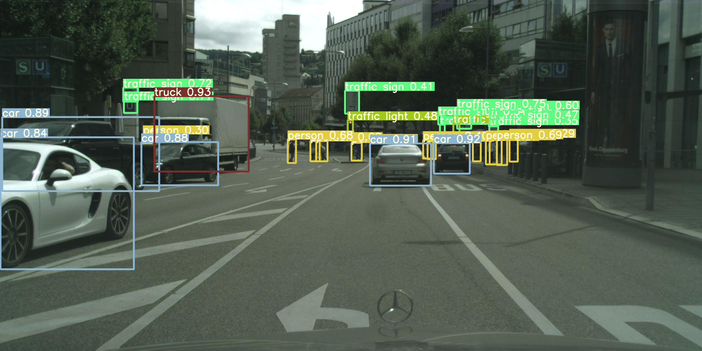
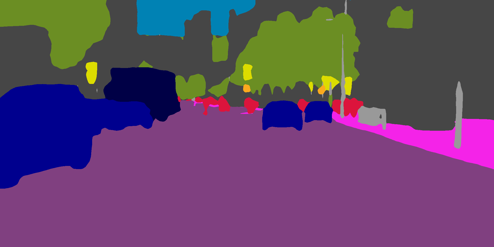

# Multi YOLO V5——Detection and Semantic Segmentation
## Overeview
This is my undergraduate graduation project which forks from <a href="https://github.com/ultralytics/yolov5"> ultralytics YOLO V5 tag v5.0</a>.  
This multi-task model adds only a small amount of computation and inferential GPU memory (about 350MB) and is able to accomplish both object detection and semantic segmentation. Object detection metrics are slightly improved (compared to single-task YOLO) on my dataset (transfer from Cityscapes Instance Segmentation labels) and Cityscapes semantic segmentation metrics are shown below. **This repository will not be updated in the near future** and a **more engineered version** will probably be released in [MANA AI](http://www.manaai.cn). To save my time and facilitate handover, please forgive me for the following document will be written in Chinese.

In the semantic segmentation section, I refer to the following code:
1. [zhanghang1989/PyTorch-Encoding: A CV toolkit for my papers. (github.com)](https://github.com/zhanghang1989/PyTorch-Encoding)
2. [CoinCheung/BiSeNet: Add bisenetv2. My implementation of BiSeNet (github.com)](https://github.com/CoinCheung/BiSeNet)  
3. [ycszen/TorchSeg: Fast, modular reference implementation and easy training of Semantic Segmentation algorithms in PyTorch. (github.com)](https://github.com/ycszen/TorchSeg)  
4. [YudeWang/semantic-segmentation-codebase: Codebase for semantic segmentation experiments (github.com)](https://github.com/YudeWang/semantic-segmentation-codebase)  

这是我的本科毕设，基于ultralytics的YOLO V5多任务模型。以增加少量计算和显存为代价，同时完成目标检测和语义分割(1024×512输入约为350MB，不开cudnn.benchmark测量，同尺寸增加一个bisenet需要约1.3GB，两个单任务模型独立输入还会有额外的延时。)。模型在Cityscapes语义分割数据集和由Cityscapes实例分割标签转换来的目标检测数据集上同时训练，检测结果略好于原版单任务的YOLOV5(仅限于此实验数据集),分割指标s模型验证集mIoU 0.73，测试集0.715;ｍ模型验证集mIoU 0.75测试集0.735。测试集结果如上图　　



## Doc
### 0. Before Start 环境配置和数据集准备
####(a) Environment
```bash
$ git checkout origin/BS2021
```
或
```bash
$ git checkout origin TomMao-2.0 
```
  BS2021分支或最新tag都可以
```bash
$ pip install -r requirements.txt  
$ python -m pip uninstall wandb  
```
**注意！当前代码不支持wandb, 不卸载大概率训练有bug**  
####(b) Data Prepare 数据集准备
当前支持Cityscapes语义分割数据集和实力分割标签生成的目标检测数据集，扩展语义分割数据集需要增改代码，目标检测数据集可以自行替换,参考原版YOLOV5和./data/cityscapes_det.yaml文件  
**下载数据**：自行到官网下载Cityscapes数据集，把leftImg8bit和gtFine放入./data/citys文件夹中，也可使用citys中的bash脚本下载，需要先把脚本中的帐号密码改成你自己的  
**数据预处理**：进到citys文件夹下运行citys文件夹的2yolo_filter.py生成目标检测标签，复制图像a但不要移动，新建一个detdata文件夹，把生成的images和labels文件夹剪切到detdata中  
注：比较费空间，只做Cityscapes的话可以考虑删除复制的图像，把leftImg8bit的图软链接到detdata中(但不要移动leftImg8bit和gtFine文件夹，分割要用)
```bash
$ python 2yolo_filter.py
$ mkdir detdata
$ mv ./images ./detdata
$ mv ./labels ./detdata
```
### 1. Inference 推理图片,用连续帧制作视频,向cCityscapes提交
####(a) 普通图片推理
```bash
$ python detect.py --weights ./BiSe.pt --source data/images --conf 0.25 --img-size 1024  
```
结果图片在runs/detect文件夹中，也可以推理同时显示  
```bash
$ python detect.py --weights ./BiSe.pt --source data/images --conf 0.25 --img-size 1024 --view-img  
```
同原版YOLOV5，--weights写你的pt文件，--source写图片文件夹，--conf检测阈值，--img-size输入resize到模型的目标长边尺寸  
####(b) 同尺寸连续帧图片制作视频
```bash
$ python detect.py --weights ./BiSe.pt --source 图片文件夹 --conf 0.25 --img-size 1024 --save-as-video  
```
我只写了同尺寸图片制作视频的支持(例如Cityscapes提供的三段连续帧测试图片)，把你的图片放入同一文件夹内，注意若存在不同尺寸图片则保存失败，若开了--no-save保存的图不会画结果  
####(c) 向Cityscapes提交测试集结果
```bash
$ python detect.py --weights ./BiSe.pt --source 图片文件夹 --conf 0.25 --img-size 1024 --submit --no-save  
```
开了--no-save会快一点并省空间，把测试集6个文件夹的图片合并在一个文件夹进行推理，结束后会在此次的runs/detect里找到一个results文件夹，里面是将trainid转换为id的结果，压缩上传官网即可  
也可以分别推理6个文件夹，结果合并压缩上传  
### 2. Test 训练后测试模型
```bash
$ python test.py --data cityscapes_det.yaml --segdata ./data/citys --weights ./BiSe.pt --img-size 1024 --base-size 1024
```
对比原版多两个参数: --segdata后写Cityscapes数据集的文件夹地址(现在只支持这个，可以参考SegmentationDataset.py自行扩展)  
检测长边和分割长边参数分离，--img-size是检测长边 --base-size是分割长边,我的配置是把Cityscapes放在1024*512尺寸下推理，比较能兼顾速度精度，训练也是以此为目的调参的.
### 3. Train 如何复现我的结果
训练前先下载对应的原版(注意我是在tag V5.0代码上改的)COCO预训练模型做初始化，见原版readme和weights/download_weights.sh脚本
```bash
$ python train.py --data cityscapes_det.yaml --cfg yolov5s_city_seg.yaml --batch-size 19 --epochs 200 --weights weights/yolov5s.pt --workers 8 --label-smoothing 0.1 --img-size 832 --noautoanchor
```
注意：没必要如示例训200轮(这是我训上述预训练模型为了让其尽量收敛的参数)，建议最少训80轮，我一般训150到170轮  
以上提到我的目标长边是1024，但这里是832，这个版本的代码为了节省显存增大batchsize和方便加aux loss决定在832上训练调参，1024上推理．训练中输出的检测指标是832的，分割指标是1024的，建议训完再用test.py测试1024的结果  
832训练检测几十轮后832的检测AP＠.5到50左右就几乎不涨了，属于正常现象，1024的AP＠.5在53到56之间．   
注意：为了加快训练我设置每10轮测试一次分割精度，最后40轮每轮测试分割精度  
832训练到几十轮时候分割损失还有震荡，属于正常现象，但务必保证warmup期间(即我打印的accumulate达到目标值前)损失不发生过大震荡  
### 4. Code guide 我修改了什么，调参／改进指南
1. 梯度积累  
学习率和检测分割损失比(后者在train.py内未暴露出来)是一组非常重要的参数．必须清楚YOLOV5使用了梯度积累，不管你的batchsize是多少，“名义batchsize”都是作者预设的64。这意味着当你设置batchsize为16时，将会每四个batch才更新一次参数(具体积累几次看训练时候的accumulate，第一次是目标值，后续是当前值)，即实际的batchsize是你输入的batchsize的倍数中最接近64的那个(此处我将原代码修改为严格不超过64)。因此你输入的batchsize 17(实际51)要比16(实际64)小很多，调整学习率时候应注意到这点。过小的batchsize影响BN层也可能导致震荡，当前参数是在11G的显卡上设置的batchsize为19，弱修改了batchsize注意观察warmup期间的损失变化，accumulate达到目标值前发生较大震荡应考虑减小学习率。
2. Common.py  
此代码是YOLOV5中的常用基础操作类，我  
原版readme分割线 

--------

<a href="https://apps.apple.com/app/id1452689527" target="_blank">
</a>

&nbsp;

<a href="https://github.com/ultralytics/yolov5/actions"></a>

This repository represents Ultralytics open-source research into future object detection methods, and incorporates lessons learned and best practices evolved over thousands of hours of training and evolution on anonymized client datasets. **All code and models are under active development, and are subject to modification or deletion without notice.** Use at your own risk.

<p align="center"></p>
<details>
  <summary>YOLOv5-P5 640 Figure (click to expand)</summary>
  
<p align="center"></p>
</details>
<details>
  <summary>Figure Notes (click to expand)</summary>
  
  * GPU Speed measures end-to-end time per image averaged over 5000 COCO val2017 images using a V100 GPU with batch size 32, and includes image preprocessing, PyTorch FP16 inference, postprocessing and NMS. 
  * EfficientDet data from [google/automl](https://github.com/google/automl) at batch size 8.
  * **Reproduce** by `python test.py --task study --data coco.yaml --iou 0.7 --weights yolov5s6.pt yolov5m6.pt yolov5l6.pt yolov5x6.pt`
</details>

- **April 11, 2021**: [v5.0 release](https://github.com/ultralytics/yolov5/releases/tag/v5.0): YOLOv5-P6 1280 models, [AWS](https://github.com/ultralytics/yolov5/wiki/AWS-Quickstart), [Supervise.ly](https://github.com/ultralytics/yolov5/issues/2518) and [YouTube](https://github.com/ultralytics/yolov5/pull/2752) integrations.
- **January 5, 2021**: [v4.0 release](https://github.com/ultralytics/yolov5/releases/tag/v4.0): nn.SiLU() activations, [Weights & Biases](https://wandb.ai/site?utm_campaign=repo_yolo_readme) logging, [PyTorch Hub](https://pytorch.org/hub/ultralytics_yolov5/) integration.
- **August 13, 2020**: [v3.0 release](https://github.com/ultralytics/yolov5/releases/tag/v3.0): nn.Hardswish() activations, data autodownload, native AMP.
- **July 23, 2020**: [v2.0 release](https://github.com/ultralytics/yolov5/releases/tag/v2.0): improved model definition, training and mAP.


## Pretrained Checkpoints

[assets]: https://github.com/ultralytics/yolov5/releases

Model |size<br><sup>(pixels) |mAP<sup>val<br>0.5:0.95 |mAP<sup>test<br>0.5:0.95 |mAP<sup>val<br>0.5 |Speed<br><sup>V100 (ms) | |params<br><sup>(M) |FLOPS<br><sup>640 (B)
---   |---  |---        |---         |---             |---                |---|---              |---
[YOLOv5s][assets]    |640  |36.7     |36.7     |55.4     |**2.0** | |7.3   |17.0
[YOLOv5m][assets]    |640  |44.5     |44.5     |63.3     |2.7     | |21.4  |51.3
[YOLOv5l][assets]    |640  |48.2     |48.2     |66.9     |3.8     | |47.0  |115.4
[YOLOv5x][assets]    |640  |**50.4** |**50.4** |**68.8** |6.1     | |87.7  |218.8
| | | | | | || |
[YOLOv5s6][assets]   |1280 |43.3     |43.3     |61.9     |**4.3** | |12.7  |17.4
[YOLOv5m6][assets]   |1280 |50.5     |50.5     |68.7     |8.4     | |35.9  |52.4
[YOLOv5l6][assets]   |1280 |53.4     |53.4     |71.1     |12.3    | |77.2  |117.7
[YOLOv5x6][assets]   |1280 |**54.4** |**54.4** |**72.0** |22.4    | |141.8 |222.9
| | | | | | || |
[YOLOv5x6][assets] TTA |1280 |**55.0** |**55.0** |**72.0** |70.8 | |-  |-

<details>
  <summary>Table Notes (click to expand)</summary>
  
  * AP<sup>test</sup> denotes COCO [test-dev2017](http://cocodataset.org/#upload) server results, all other AP results denote val2017 accuracy.  
  * AP values are for single-model single-scale unless otherwise noted. **Reproduce mAP** by `python test.py --data coco.yaml --img 640 --conf 0.001 --iou 0.65`  
  * Speed<sub>GPU</sub> averaged over 5000 COCO val2017 images using a GCP [n1-standard-16](https://cloud.google.com/compute/docs/machine-types#n1_standard_machine_types) V100 instance, and includes FP16 inference, postprocessing and NMS. **Reproduce speed** by `python test.py --data coco.yaml --img 640 --conf 0.25 --iou 0.45`  
  * All checkpoints are trained to 300 epochs with default settings and hyperparameters (no autoaugmentation). 
  * Test Time Augmentation ([TTA](https://github.com/ultralytics/yolov5/issues/303)) includes reflection and scale augmentation. **Reproduce TTA** by `python test.py --data coco.yaml --img 1536 --iou 0.7 --augment`
</details>


## Requirements

Python 3.8 or later with all [requirements.txt](https://github.com/ultralytics/yolov5/blob/master/requirements.txt) dependencies installed, including `torch>=1.7`. To install run:
```bash
$ pip install -r requirements.txt
```


## Tutorials

* [Train Custom Data](https://github.com/ultralytics/yolov5/wiki/Train-Custom-Data)&nbsp; 🚀 RECOMMENDED
* [Tips for Best Training Results](https://github.com/ultralytics/yolov5/wiki/Tips-for-Best-Training-Results)&nbsp; ☘️ RECOMMENDED
* [Weights & Biases Logging](https://github.com/ultralytics/yolov5/issues/1289)&nbsp; 🌟 NEW
* [Supervisely Ecosystem](https://github.com/ultralytics/yolov5/issues/2518)&nbsp; 🌟 NEW
* [Multi-GPU Training](https://github.com/ultralytics/yolov5/issues/475)
* [PyTorch Hub](https://github.com/ultralytics/yolov5/issues/36)&nbsp; ⭐ NEW
* [ONNX and TorchScript Export](https://github.com/ultralytics/yolov5/issues/251)
* [Test-Time Augmentation (TTA)](https://github.com/ultralytics/yolov5/issues/303)
* [Model Ensembling](https://github.com/ultralytics/yolov5/issues/318)
* [Model Pruning/Sparsity](https://github.com/ultralytics/yolov5/issues/304)
* [Hyperparameter Evolution](https://github.com/ultralytics/yolov5/issues/607)
* [Transfer Learning with Frozen Layers](https://github.com/ultralytics/yolov5/issues/1314)&nbsp; ⭐ NEW
* [TensorRT Deployment](https://github.com/wang-xinyu/tensorrtx)


## Environments

YOLOv5 may be run in any of the following up-to-date verified environments (with all dependencies including [CUDA](https://developer.nvidia.com/cuda)/[CUDNN](https://developer.nvidia.com/cudnn), [Python](https://www.python.org/) and [PyTorch](https://pytorch.org/) preinstalled):

- **Google Colab and Kaggle** notebooks with free GPU: <a href="https://colab.research.google.com/github/ultralytics/yolov5/blob/master/tutorial.ipynb"></a> <a href="https://www.kaggle.com/ultralytics/yolov5"></a>
- **Google Cloud** Deep Learning VM. See [GCP Quickstart Guide](https://github.com/ultralytics/yolov5/wiki/GCP-Quickstart)
- **Amazon** Deep Learning AMI. See [AWS Quickstart Guide](https://github.com/ultralytics/yolov5/wiki/AWS-Quickstart)
- **Docker Image**. See [Docker Quickstart Guide](https://github.com/ultralytics/yolov5/wiki/Docker-Quickstart) <a href="https://hub.docker.com/r/ultralytics/yolov5"></a>


## Inference

`detect.py` runs inference on a variety of sources, downloading models automatically from the [latest YOLOv5 release](https://github.com/ultralytics/yolov5/releases) and saving results to `runs/detect`.
```bash
$ python detect.py --source 0  # webcam
                            file.jpg  # image 
                            file.mp4  # video
                            path/  # directory
                            path/*.jpg  # glob
                            'https://youtu.be/NUsoVlDFqZg'  # YouTube video
                            'rtsp://example.com/media.mp4'  # RTSP, RTMP, HTTP stream
```

To run inference on example images in `data/images`:
```bash
$ python detect.py --source data/images --weights yolov5s.pt --conf 0.25

Namespace(agnostic_nms=False, augment=False, classes=None, conf_thres=0.25, device='', exist_ok=False, img_size=640, iou_thres=0.45, name='exp', project='runs/detect', save_conf=False, save_txt=False, source='data/images/', update=False, view_img=False, weights=['yolov5s.pt'])
YOLOv5 v4.0-96-g83dc1b4 torch 1.7.0+cu101 CUDA:0 (Tesla V100-SXM2-16GB, 16160.5MB)

Fusing layers... 
Model Summary: 224 layers, 7266973 parameters, 0 gradients, 17.0 GFLOPS
image 1/2 /content/yolov5/data/images/bus.jpg: 640x480 4 persons, 1 bus, Done. (0.010s)
image 2/2 /content/yolov5/data/images/zidane.jpg: 384x640 2 persons, 1 tie, Done. (0.011s)
Results saved to runs/detect/exp2
Done. (0.103s)
```
  

### PyTorch Hub

To run **batched inference** with YOLOv5 and [PyTorch Hub](https://github.com/ultralytics/yolov5/issues/36):
```python
import torch

# Model
model = torch.hub.load('ultralytics/yolov5', 'yolov5s')

# Images
dir = 'https://github.com/ultralytics/yolov5/raw/master/data/images/'
imgs = [dir + f for f in ('zidane.jpg', 'bus.jpg')]  # batch of images

# Inference
results = model(imgs)
results.print()  # or .show(), .save()
```


## Training

Run commands below to reproduce results on [COCO](https://github.com/ultralytics/yolov5/blob/master/data/scripts/get_coco.sh) dataset (dataset auto-downloads on first use). Training times for YOLOv5s/m/l/x are 2/4/6/8 days on a single V100 (multi-GPU times faster). Use the largest `--batch-size` your GPU allows (batch sizes shown for 16 GB devices).
```bash
$ python train.py --data coco.yaml --cfg yolov5s.yaml --weights '' --batch-size 64
                                         yolov5m                                40
                                         yolov5l                                24
                                         yolov5x                                16
```


## Citation

[](https://zenodo.org/badge/latestdoi/264818686)


## About Us

Ultralytics is a U.S.-based particle physics and AI startup with over 6 years of expertise supporting government, academic and business clients. We offer a wide range of vision AI services, spanning from simple expert advice up to delivery of fully customized, end-to-end production solutions, including:
- **Cloud-based AI** systems operating on **hundreds of HD video streams in realtime.**
- **Edge AI** integrated into custom iOS and Android apps for realtime **30 FPS video inference.**
- **Custom data training**, hyperparameter evolution, and model exportation to any destination.

For business inquiries and professional support requests please visit us at https://www.ultralytics.com. 


## Contact

**Issues should be raised directly in the repository.** For business inquiries or professional support requests please visit https://www.ultralytics.com or email Glenn Jocher at glenn.jocher@ultralytics.com. 
